# HotelBookingWebsite
A simple website for booking rooms in Hotel.


## Features

- Book Room
- Download Recipt
- Cancle Booking
- facilities
- contact us

## Software Requirements

- Node.js
- MongoDB

## How to install

### Using manual download ZIP

1.  Download repository
2.  Uncompress to your desired directory

### Install npm dependencies after installing (Git or manual download)

```bash
npm install
```

## How to run

### Running API server locally

```bash
node app.js
```
If you have nodemon package then,

```bash
nodemon app.js
```

You will know server is running by checking the output of the command `node app.js`

# Screenshot
## Home Page
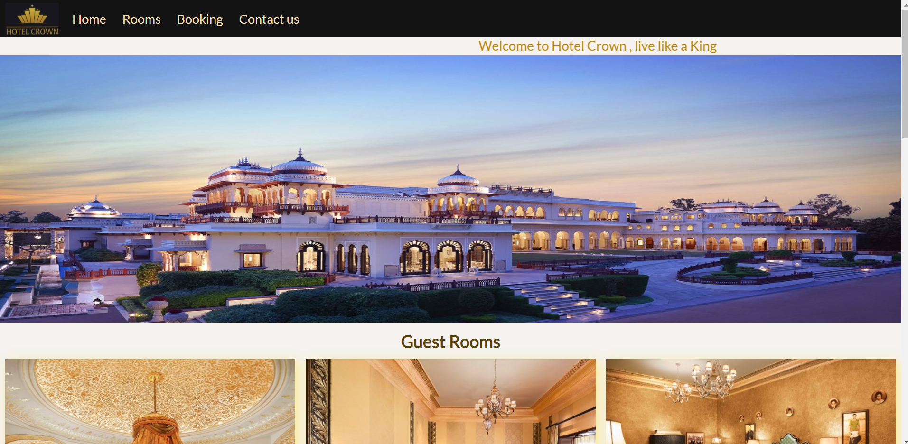
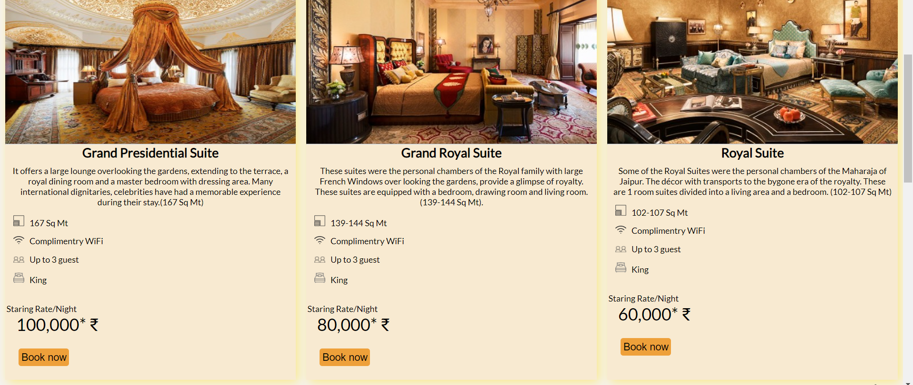
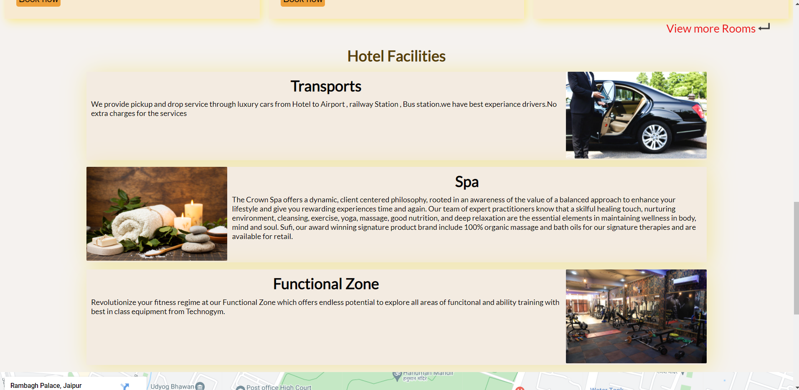
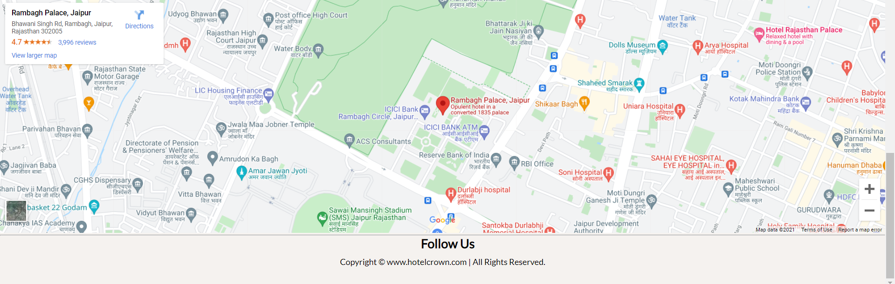

## Room Page
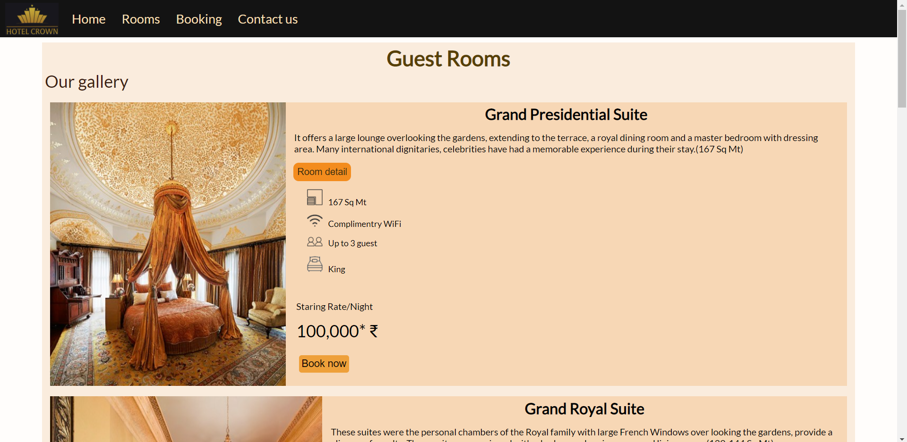
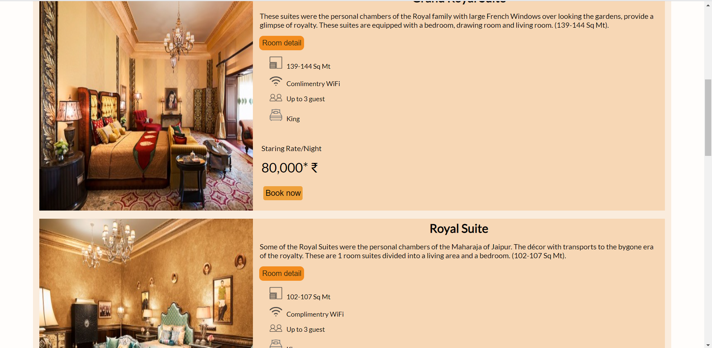
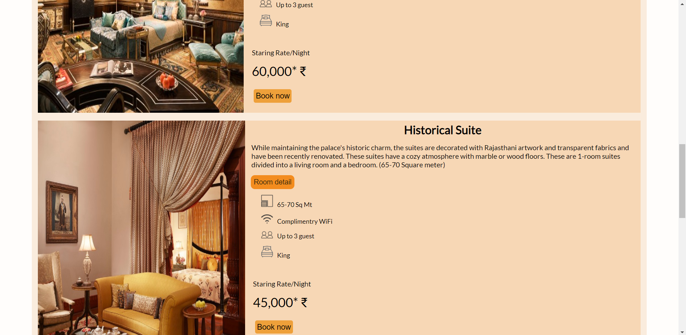
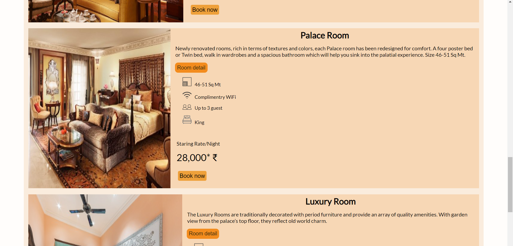
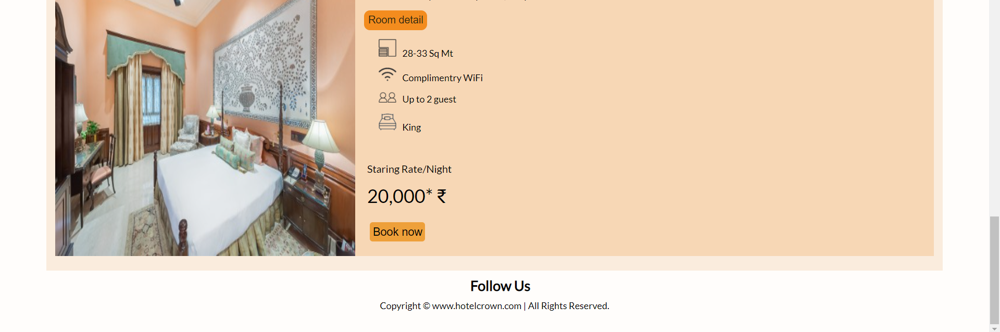
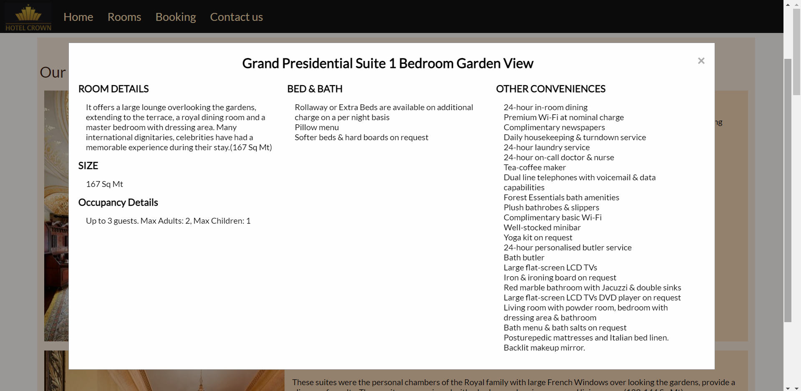

## Gallery
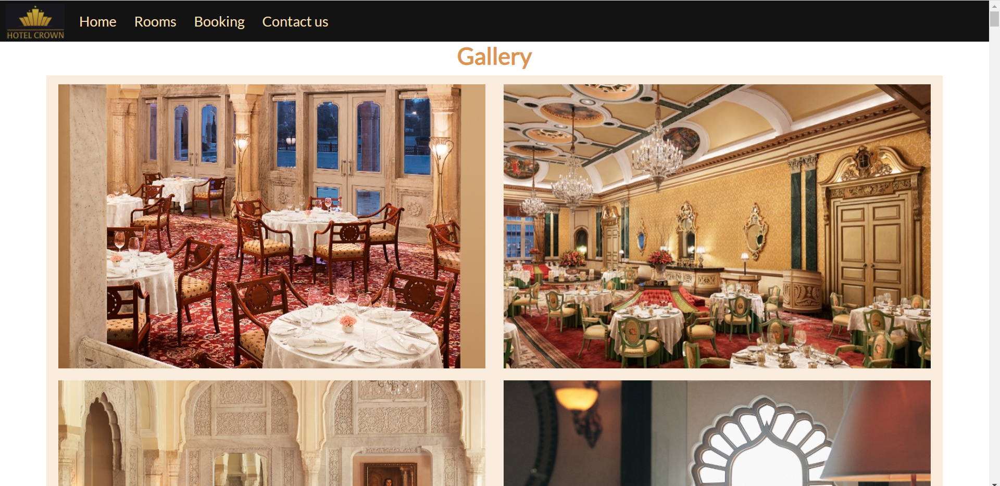
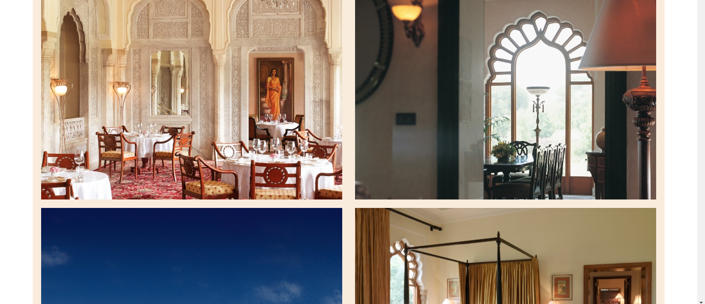
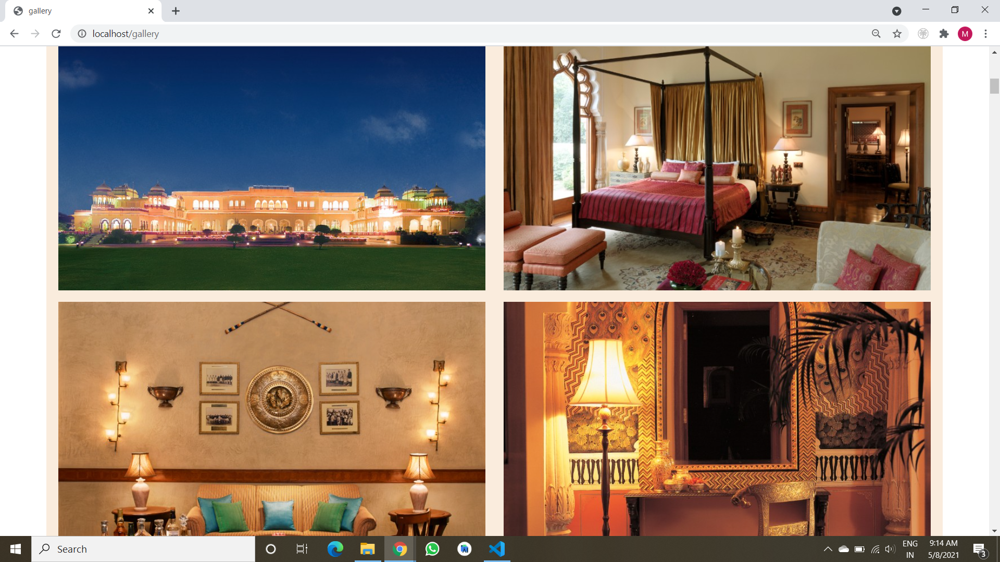

## Booking
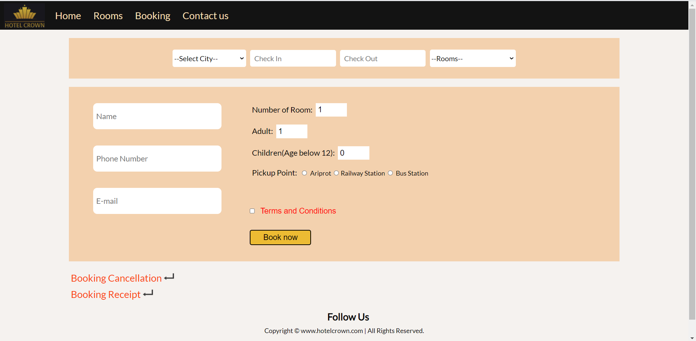
